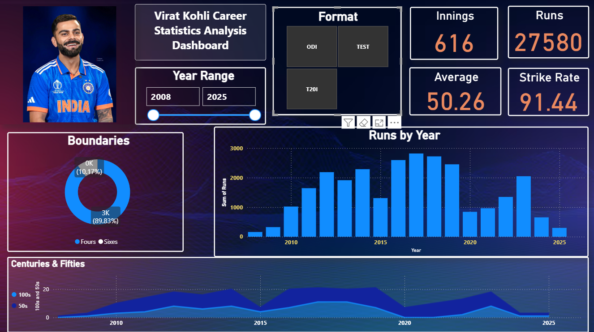
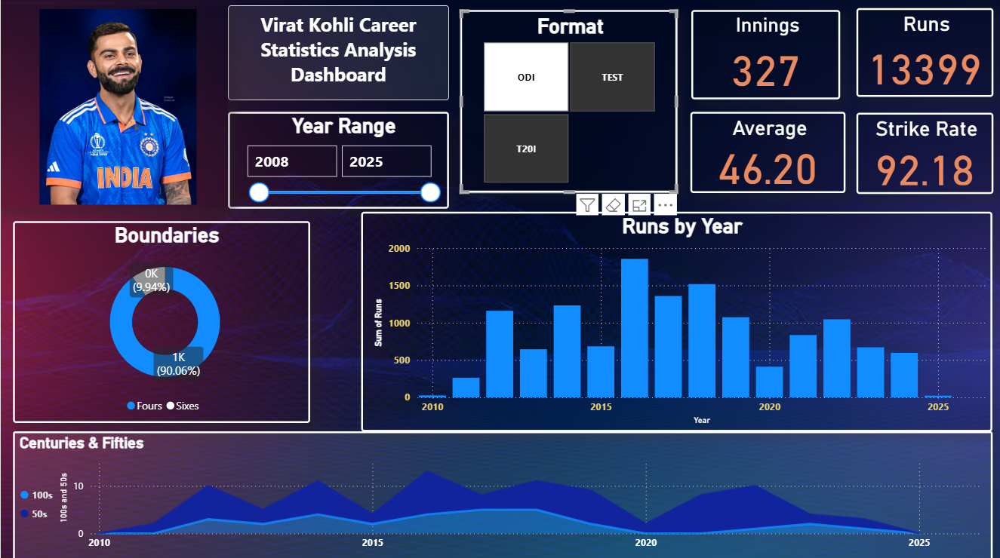
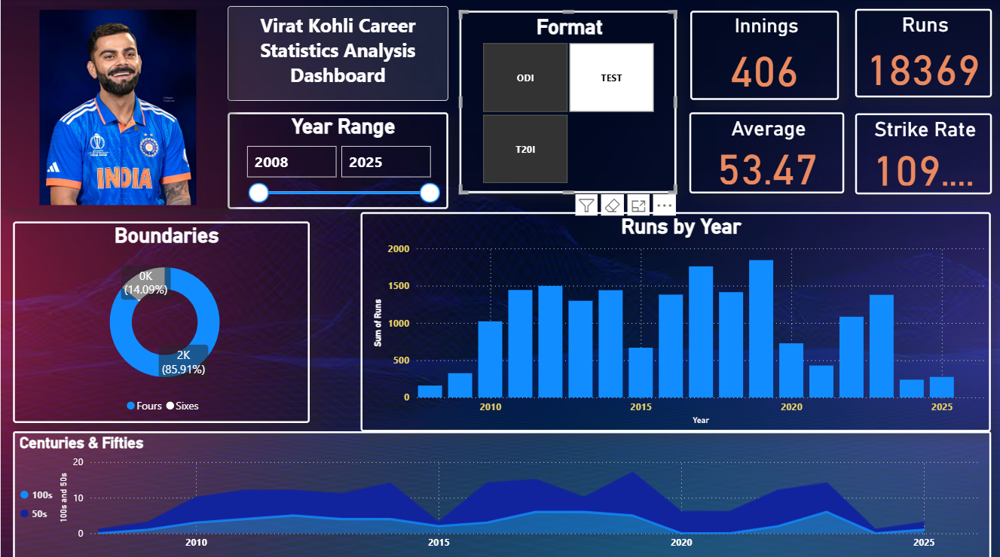
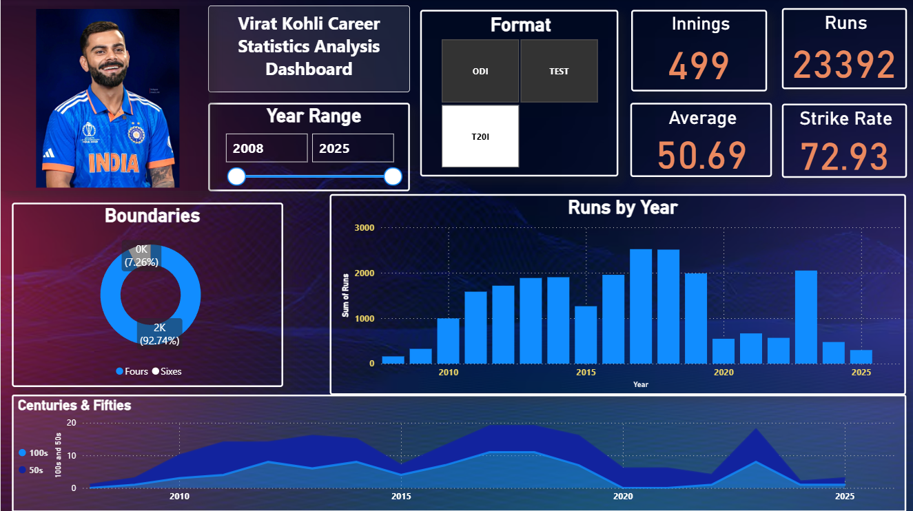

# Virat Kohli Career Analytics

An interactive **Virat Kohli Career Performance Analytics Dashboard** built using **Microsoft Power BI** and **Excel** to analyze his batting performance across ODI, Test, and T20I formats.

## 📊 Project Overview

This project analyzes Virat Kohli's international cricket career performance using historical batting data.

The dashboard provides an interactive view of:

- Overall career performance
- ODI performance
- Test performance
- T20I performance
- Runs by year
- Batting average
- Strike rate
- Number of innings
- Total runs
- Boundaries
- Centuries and fifties
- Year-wise performance trends

Users can switch between **ODI, Test, and T20I** formats to analyze performance across different formats.

## 🛠️ Tools & Technologies

- **Microsoft Power BI** – Dashboard development and data visualization
- **Microsoft Excel** – Data preparation and analysis
- **DAX** – Measures and calculations
- **Data Visualization** – Charts, KPI cards, and interactive filters

## 📌 Dashboard Features

### Format Selection

The dashboard allows users to select:

- ODI
- Test
- T20I

The KPI cards and visualizations update according to the selected format.

### Key Performance Indicators

The dashboard displays:

- Innings
- Total Runs
- Batting Average
- Strike Rate

### Year-wise Analysis

The **Runs by Year** chart shows Virat Kohli's run-scoring performance across different years.

### Boundary Analysis

The dashboard compares:

- Fours
- Sixes

using a donut chart.

### Centuries & Fifties

The dashboard provides a year-wise view of:

- 100s
- 50s

to understand consistency and major scoring performances throughout his career.

## 📷 Dashboard Screenshots

### Overall Dashboard

### ODI Dashboard

### Test Dashboard

### T20I Dashboard

## 📂 Project Files

- `Virat Kohli Dashboard.xlsx` – Excel data and analysis file
- `ViratkohliDashboard.pbix` – Power BI dashboard file
- `Screenshots-Dashboards/` – Dashboard screenshots

## 📈 Key Analysis Areas

This project focuses on understanding:

1. How Virat Kohli's performance varies across cricket formats.
2. His yearly run-scoring trends.
3. His batting average and strike rate across formats.
4. His boundary-scoring patterns.
5. His consistency in scoring fifties and centuries.
6. Differences between ODI, Test, and T20I batting performance.

## 🎯 Project Objective

The objective of this project is to demonstrate practical skills in:

- Data cleaning
- Data analysis
- DAX calculations
- Data visualization
- Dashboard design
- Business intelligence
- Interactive reporting

## 🔍 Key Findings & Insights

The dashboard provides several insights into Virat Kohli's batting performance across different formats.

### Overall Career Analysis

Based on the dashboard:

- **Total Innings:** 616
- **Total Runs:** 27,580
- **Overall Batting Average:** 50.26
- **Overall Strike Rate:** 91.44

These KPIs provide an overall view of batting performance across the selected formats and year range.

### ODI Analysis

The ODI dashboard shows:

- **Innings:** 327
- **Runs:** 13,399
- **Batting Average:** 46.20
- **Strike Rate:** 92.18

The year-wise analysis shows significant variation in run-scoring performance across different years, with several strong scoring periods visible in the dashboard.

### Test Analysis

The Test dashboard shows:

- **Innings:** 406
- **Runs:** 18,369
- **Batting Average:** 53.47
- **Strike Rate:** 109.00+

The Test analysis highlights the variation in yearly run production and the distribution of centuries and fifties across the selected period.

### T20I Analysis

The T20I dashboard shows:

- **Innings:** 499
- **Runs:** 23,392
- **Batting Average:** 50.69
- **Strike Rate:** 72.93

The T20I analysis provides a year-wise view of run scoring along with boundary distribution and fifty/century trends.

### Cross-Format Comparison

The dashboard makes it possible to compare batting performance across ODI, Test, and T20I formats using:

- Total runs
- Number of innings
- Batting average
- Strike rate
- Fours and sixes
- Centuries and fifties
- Year-wise run production

This comparison helps identify differences in scoring patterns, consistency, and performance across formats.

> **Note:** The values presented above are based on the dataset and dashboard used in this project.

## 👨‍💻 Author

**Kunal Gupta**

Aspiring Data Analyst | BBA Student

### Skills

**Excel • SQL • Power BI • DAX • Data Analytics • Data Visualization**

## 📬 Contact

If you would like to connect with me regarding data analytics, projects, collaborations, or opportunities:

- **Email:** [kunal7836ok@gmail.com](mailto:kunal7836ok@gmail.com)
- **LinkedIn:** [Kunal Gupta](https://www.linkedin.com/in/kunal-gupta-71210836a/)
- **GitHub:** [Kunal-Gupta-analytics](https://github.com/Kunal-Gupta-analytics)
